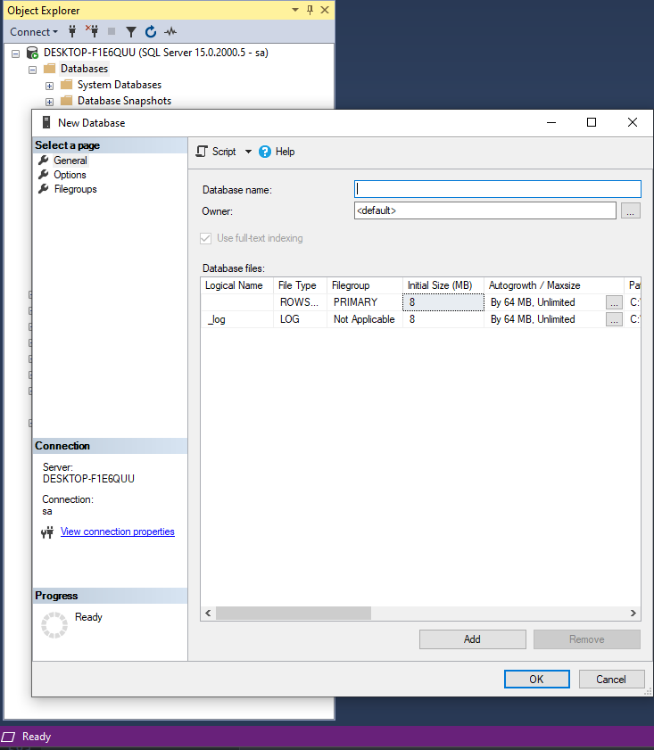
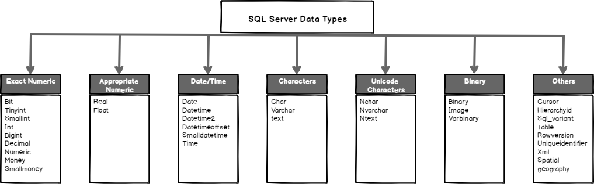
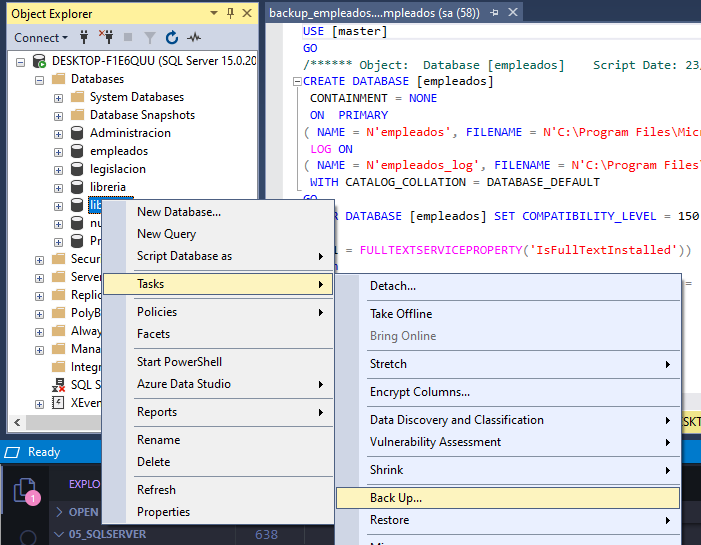
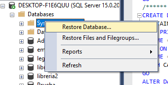
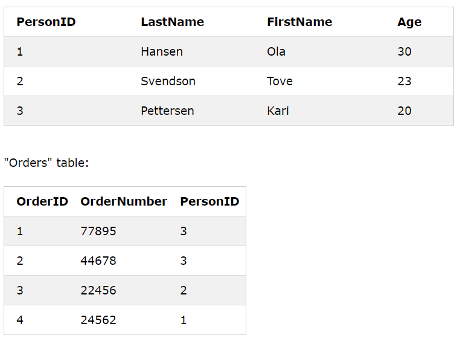

# Introduccion

Documentacion en base del curso 

```
    Curso de SQL Server - deividcoptero Programación
    https://www.youtube.com/watch?v=kxgsBHMjSgE&list=PL6hPvfzEEMDaU4aiS389oXamdN8sip856
```

SQL server es un motor de base de datos creado por microsoft, aprender y a manejar sql server y aprender lenguajes para manejar base de datos sql. 

***DBO*** = base de datos.propietario.objeto

# Creacion y elimnacion de una bd

Manera grafica



Manera script
```sql

-- Creacion de una base de datos
create database [legislacion]

-- Eliminacion base de datos
drop database [legislacion]

```

# Tipo de datos



# Creacion y eliminacion de tablas

```sql
-- creacion de la tabla
create table nametable(
    id_name int not null,
    nombre varchar(50) null
)

-- eliminar tabla
drop table nametable
```

# Insercion de datos

```sql
-- creacion de tabla
create table usuarios(
    id_usuario int primary key,
    nombre varchar(50) not null,
    edad int not null
)

use usuarios

-- insertar datos
insert into 
    usuarios 
values 
    (1, 'usuario1', 26);

insert into 
    usuarios 
values 
    (2, 'usuario2', 27);

insert into 
    usuarios 
values 
    (3, 'usuario3', 20);

insert into 
    usuarios 
values 
    (4, 'usuario4', 21);

insert into 
    usuarios 
values 
    (5, 'usuario5', 24);
```

# Consultas

```sql
use legislacion

select * from dbo.usuarios
select id_usuario from usuarios
select id_usuario, nombre from usuarios
```

# WHERE

```sql
-- condicion 1
select 
    * 
from 
    usuarios
where usuarios.nombre = 'usuario1'

-- condicion 2
select 
    * 
from 
    usuarios
where usuarios.id_usuario = 1
```

# Operadores relaciones

```sql

-- mayor o igual
select 
    nombre
from
    usuarios
where
    id_usuario >= 3

-- sea diferente
select 
    nombre
from
    usuarios
where
    nombre <> 'usuario1'

-- que sea igual
select 
    [nombre]
from
    [usuarios]
where
    [legislacion].[dbo].[nombre
     = 'usuario1'
```

# Eliminacion de registros

```sql
-- delete : elimina registros de forma condicional
delete from 
    usuarios
where id_usuario = 7

-- drop : elimina la estructura (tabla)
drop table usuarios

-- truncate : elimina los registros (reset) incrimentadores = 0
truncate table usuarios
```

# Actualizar Registros

```sql
update 
    [legislacion].[dbo].[usuarios]
set 
    [nombre] = 'kevin'
where
    [id_usuario] = 1
```

# identity 

propiedad, atributo extra que se le puede poner a los campos, es parecido auto incremento (pero son diferentes), por defecto el identity empieza en 1 y su incremento es de 1, no permite valores nulos, se usa con numeros enteros, no es permitido la introduccion del campo. permite que los numeros se repite

Solo se permite una por tabla.

```sql
USE AdventureWorks2012;  
  
IF OBJECT_ID ('dbo.new_employees', 'U') IS NOT NULL  
   DROP TABLE new_employees;  
GO  
CREATE TABLE new_employees  
(  
    id_num int IDENTITY(4000,2) NOT NULL,  
    fname varchar (20),  
    minit char(1),  
    lname varchar(30),
    PRIMARY KEY(id_num)
);  
  
INSERT new_employees  
   (fname, minit, lname)  
VALUES  
   ('Karin', 'F', 'Josephs');  
  
INSERT new_employees  
   (fname, minit, lname)  
VALUES  
   ('Pirkko', 'O', 'Koskitalo');  


-- saber valores de indice y inicio

SELECT ident_SEED('new_employees'):
SELECT ident_INCR('new_employees'):

-- activar poder insertar datos de identity
set identity_insert new_employees on;
INSERT new_employees  
   (id_num, fname, minit, lname)  
VALUES  
   (77,'Pirkko', 'O', 'Koskitalo');  

set identity_insert new_employees off;
```

# Operadores aritmeticos

```sql

-- creacion del ejercicio
CREATE DATABASE [libreria];
USE libreria;

CREATE TABLE libros
(
    id_libro        INT         IDENTITY(4000,1) PRIMARY KEY,
    nombre          VARCHAR(60) NOT NULL,
    precio_venta    INT         NOT NULL,
    precio_compra   FLOAT       NOT NULL    
);

INSERT INTO
    libros
VALUES('LIBRE1', 115, 95.22);

INSERT INTO
    libros
VALUES('LIBRE2', 122, 60.22);

INSERT INTO
    libros
VALUES('LIBRE3', 200, 45.545);

INSERT INTO
    libros
VALUES('LIBRE4', 250, 25.22);

INSERT INTO
    libros
VALUES('LIBRE5', 300, 15.22);

-- todos los campos
SELECT * FROM libros

-- solo un campo
SELECT nombre FROM libros;

-- sacar las ganancias de cada libro
SELECT 
	nombre, precio_venta - precio_compra as ganancia
FROM 
    libros;

-- Presupuesto
SELECT 
    nombre, precio_venta * 10 
FROM 
    libros
WHERE
    id_libro = 4002;

-- actualizacion
UPDATE 
    libros
SET
    precio_venta = precio_venta + (precio_venta * 0.1)
WHERE
    id_libro = 4002;
```

# Funciones de agregado

Conjunto de sentencias que hace unas operaciones.

```sql
CREATE DATABASE libreria2;

USE libreria2;

CREATE TABLE libros(
    id_libro INT IDENTITY PRIMARY KEY NOT NULL,
    titulo VARCHAR(50) NOT NULL,
    descripcion VARCHAR(59),
    autor VARCHAR(50) NOT NULL,
    precio_v INT NOT NULL,
    precio_c INT NOT NULL
);

INSERT INTO 
    libros
VALUES(
    'TITULO1','DESCRIPCION1','AUTOR1', 99,55
);

INSERT INTO 
    libros
VALUES(
    'TITULO2','DESCRIPCION2','AUTOR2', 200,100
);

INSERT INTO 
    libros
VALUES(
    'TITULO3','DESCRIPCION3','AUTOR3', 350,60
);

INSERT INTO 
    libros
VALUES(
    'TITULO4','DESCRIPCION4','AUTOR4', 200,70
);

-- count : cuenta
-- saber cuantos libros son
SELECT 
    COUNT(id_libro) AS cantidad_libros 
FROM 
    libros;

-- cuantos libros hay que sean mayor que 100
SELECT 
    COUNT(id_libro) AS cantidad_libros 
FROM 
    libros 
WHERE 
    precio_v > 100;

-- sum : suma
-- comprar todos los libros
SELECT 
    SUM(precio_v) as TOTAL
FROM 
    libros;

-- max : maximo
-- el libro mas caro
SELECT 
    MAX(precio_v) as MAS_CARO
FROM 
    libros;

-- min : minimo
-- el libro mas barato
SELECT 
    MIN(precio_v) as MAS_BARATO
FROM 
    libros;

SELECT 
    product_id,
    product_name,
    list_price
FROM 
    production.products
WHERE 
    list_price = (
        SELECT 
            MAX(list_price )
        FROM
            production.products);

-- AVG
SELECT 
    AVG(precio_v) as MAS_BARATO
FROM 
    libros;
```

# Concatenacion y alias
Concatenacion : union de dos o mas cadenas

```sql
USE libreria;

-- concatenar y castear un valor y alias
SELECT 
    nombre + ' => ' + 
    CAST(precio_venta AS VARCHAR(50)) 
    AS TEXTO_RESULTADO
FROM 
    libros;

```

# Funciones de manejo de cadenas

```sql
DECLARE @CADENA_TOTAL VARCHAR(100);
SET @CADENA_TOTAL = 'HOLA A TODOS'

-- SUBSTRING
SELECT SUBSTRING(@CADENA_TOTAL, 8, 5) 

-- CONVERTIR DE NUMERO A TEXTO
SELECT STR(4555);

-- REEMPLAZAR
SELECT STUFF(@CADENA_TOTAL, 8, 8 ,'CAMBIADO');

-- MEDIR CADENA
SELECT LEN(@CADENA_TOTAL);

-- DIGITO A CODIGO ASCII
SELECT CHAR(64);


DECLARE @CADENA_TOTAL VARCHAR(300);
SET @CADENA_TOTAL = 'HOLA A TODOS';

-- mayusculas 
SELECT LOWER(@CADENA_TOTAL);

-- minusculas
SELECT UPPER(@CADENA_TOTAL);

-- QUITAR ESPACIOS AL DERECHA Y EZQUIERDA
SELECT LTRIM(@CADENA_TOTAL);
SELECT RTRIM(@CADENA_TOTAL);

-- REEMPLAZAR CADENAS
SELECT REPLACE(@CADENA_TOTAL,'TODOS', 'CAMBIADO');

-- INVERTIR PALABRA
SELECT REVERSE(@CADENA_TOTAL);

-- BUSCAR COINCIDENCIAS
SELECT PATINDEX('%TODOS%', @CADENA_TOTAL);

-- MULTIPLICACION
SELECT REPLICATE('HOLA', 5);

-- ESPACIOS EN LA CADENA
SELECT 'PRUEBA'+SPACE(3)+'PRUEBA';

```

# Order By

```sql
-- ordenar por defecto
SELECT 
	titulo
FROM
	libros
ORDER BY
	titulo ASC;

-- orderna
SELECT 
	*
FROM
	libros
ORDER BY
	precio_v DESC;

-- ordernar todos los campos
-- orderna
SELECT 
	*
FROM
	libros
ORDER BY
	precio_v DESC, precio_c ASC;

```

# Operadores logicos

not, and, or

```sql

-- not
SELECT
	*
FROM
	libros
WHERE
	id_libro != 1;

-- and
SELECT
	*
FROM
	libros
WHERE
	precio_v <= 100 AND
	precio_v >= 50;

-- or
SELECT 
	*
FROM
	libros
WHERE
	id_libro = 2 OR
	id_libro = 3;
```

# is null between

```sql
CREATE DATABASE null_exer;

USE null_exer;

CREATE TABLE table_null(
	id INT IDENTITY(400,3) NOT NULL PRIMARY KEY,
	nombre TEXT not null,
	apellido TEXT null,
	registro DATETIME NOT NULL
);

insert 
	table_null
		(nombre, apellido, registro)
values(
	'prueba', 'prueba', CURRENT_TIMESTAMP
);

-- TRAER LOS REGISTROS SEAN NULOS Y NO NULOS
SELECT 
	*
FROM
	table_null
WHERE
	apellido IS NULL;

SELECT 
	*
FROM
	table_null
WHERE
	apellido IS NOT NULL;

-- BETWEEN

SELECT
	*
FROM
	table_null
WHERE
	registro BETWEEN 
	'2020-11-22 18:28:24.447' AND '2020-11-22 18:28:59.920'

SELECT
	*
FROM
	table_null
WHERE
	id between 403 and 410;

```


# like not like

especificamente para cadenas, busca coincidencias las palabras o con ciertas expresiones dadas.

```sql
-- like
SELECT 
    *
FROM 
    libros
WHERE 
    LIKE '%frase exacta y frases%';

-- not like
SELECT
    *
FROM 
    libros
WHERE
    NOT LIKE 'frase exacta y frases%';

-- not like
SELECT
    *
FROM 
    libros
WHERE
    NOT LIKE '%frase PALAB_A frases';


```

# having

el where es un filtro de manera indivisual, having es por grupo de registros

```sql
SELECT
    *
FROM 
    nombre, avg(edad) a
WHERE
    sexo = 'F';
GROUP BY nombre
HAVING avg(edad) > 20
ORDER BY nombre;
```
# distinct

eliminar campos repetidos

```sql
SELECT
	DISTINCT edad
FROM
	usuarios
ORDER BY edad;

-- OPERADORES DE AGRUPACION 
SELECT
	SUM( DISTINCT edad )
FROM
	usuarios;
```

# Top

selecciona un numero de registros 

```sql
-- PRIMEROS
SELECT 
	TOP 10 *
FROM
	usuarios;

-- ULTIMOS
SELECT 
	TOP 10 *
FROM
	usuarios
ORDER BY id_usuario DESC;
```

# Respaldo y restauracion de una base de datos

C:\Program Files\Microsoft SQL Server\MSSQL15.MSSQLSERVER\MSSQL\Backup\

- backup



- restore



# Llaves foreneas



```sql

-- creacion con la misma tabla
CREATE TABLE Orders (
    OrderID int NOT NULL,
    OrderNumber int NOT NULL,
    PersonID int,
    PRIMARY KEY (OrderID),
    CONSTRAINT FK_PersonOrder FOREIGN KEY (PersonID)
    REFERENCES Persons(PersonID)
);

-- creacion despues de la tabla
ALTER TABLE Orders
ADD CONSTRAINT FK_PersonOrder
FOREIGN KEY (PersonID) REFERENCES Persons(PersonID);

-- borrado de la llave
ALTER TABLE Orders
DROP CONSTRAINT FK_PersonOrder;

```

Ejercicio

```sql
-- CREACION DE TABLAS
CREATE TABLE Datos(
	id_datos INT IDENTITY(1000,1) NOT NULL PRIMARY KEY,
	id_alumno INT NOT NULL,
	correo	varchar(200) NOT NULL,
	edad	INT		NOT NULL
);

CREATE TABLE Alumnos(
	id_alumno	INT IDENTITY(2000,1) NOT NULL PRIMARY KEY,
	nombre	VARCHAR(100) NOT NULL,
	apellidos VARCHAR(100) NOT NULL,
	id_carrera INT NOT NULL
);

CREATE TABLE Carrera(
	id_carrera INT IDENTITY(3000,1) NOT NULL PRIMARY KEY,
	carrera VARCHAR(100) NOT NULL
);

-- CREACION DE LLAVES FORANEAS
ALTER TABLE Datos
ADD CONSTRAINT Fk_AlumnosDatos
FOREIGN KEY (id_alumno) REFERENCES Alumnos(id_alumno);

ALTER TABLE Alumnos
ADD CONSTRAINT Fk_CarreraAlumnos
FOREIGN KEY (id_carrera) REFERENCES Carrera(id_carrera);

--- INSERCION DE DATOS
INSERT	Carrera(carrera)
VALUES('Ingenieria de sistemas');

INSERT	Carrera(carrera)
VALUES('Psicologia');

INSERT	Carrera(carrera)
VALUES('Matematicas');


INSERT Alumnos(nombre, apellidos, id_carrera)
VALUES('Kevin','Quiroga', 3000);
INSERT Alumnos(nombre, apellidos, id_carrera)
VALUES('Andres','Ramirez', 3000);
INSERT Alumnos(nombre, apellidos, id_carrera)
VALUES('Pepegrillo','Astroz', 3000);

INSERT Alumnos(nombre, apellidos, id_carrera)
VALUES('Andrea','Guitierrez', 3001);
INSERT Alumnos(nombre, apellidos, id_carrera)
VALUES('Santiago','Gonzalez', 3001);
INSERT Alumnos(nombre, apellidos, id_carrera)
VALUES('Valentina','Rodrigue<', 3001);

INSERT Alumnos(nombre, apellidos, id_carrera)
VALUES('Carolina','Plata', 3002);
INSERT Alumnos(nombre, apellidos, id_carrera)
VALUES('Camilo','Prado', 3002);
INSERT Alumnos(nombre, apellidos, id_carrera)
VALUES('Jorge','Rojas', 3002);

INSERT Datos(id_alumno, correo, edad)
VALUES(2000, 'kevin@gmail.com', 20);
INSERT Datos(id_alumno, correo, edad)
VALUES(2001, 'andres@gmail.com', 23);
INSERT Datos(id_alumno, correo, edad)
VALUES(2002, 'pepegrillo@gmail.com', 17);
INSERT Datos(id_alumno, correo, edad)
VALUES(2003, 'andrea@gmail.com', 18);
INSERT Datos(id_alumno, correo, edad)
VALUES(2004, 'santiago@gmail.com', 25);
INSERT Datos(id_alumno, correo, edad)
VALUES(2005, 'valentina@gmail.com', 30);
INSERT Datos(id_alumno, correo, edad)
VALUES(2006, 'carolina@gmail.com', 40);
INSERT Datos(id_alumno, correo, edad)
VALUES(2007, 'camilo@gmail.com', 16);
INSERT Datos(id_alumno, correo, edad)
VALUES(2008, 'jorge@gmail.com', 19);

```

# JOINS


# Inner Join

UNION ENTRE DOS O MAS TABLAS

```sql
-- select para visualizar la tabla
SELECT * FROM Alumnos;
SELECT * FROM Carrera;
SELECT * FROM Datos;

-- une las tres tablas
SELECT *
FROM Datos
INNER JOIN Alumnos on  Datos.id_alumno = Alumnos.id_alumno
INNER JOIN Carrera on Alumnos.id_carrera = Carrera.id_carrera;

-- Saber el correo electronico, el nombre y la carrera que pertenece
-- une las tres tablas pero solo muestra campos especificos
SELECT correo, nombre, carrera
FROM Datos
INNER JOIN Alumnos on  Datos.id_alumno = Alumnos.id_alumno
INNER JOIN Carrera on Alumnos.id_carrera = Carrera.id_carrera;

-- con where filtrando ingenieria de sistemas
SELECT correo, nombre, carrera
FROM Datos
INNER JOIN Alumnos on  Datos.id_alumno = Alumnos.id_alumno
INNER JOIN Carrera on Alumnos.id_carrera = Carrera.id_carrera
WHERE Carrera.id_carrera=3000;

```

# Join left

mostrar todos los datos aunque no haya relacion, solo para dos tablas, voy a tomar los datos de alumnos y le voy a pegar los datos de tabla datos y los que no encuentre los lleno con null.

```sql
SELECT * 
FROM Alumnos
left join Datos on Alumnos.id_alumno = Datos.id_alumno;
```

# Right join

```sql
-- trae los datos de la tabla derecha y los une con la tabla izquierda
SELECT *
FROM Datos
RIGHT JOIN Alumnos on Datos.id_alumno = Alumnos.id_alumno
;

-- con where
SELECT *
FROM Datos
RIGHT JOIN Alumnos on Datos.id_alumno = Alumnos.id_alumno
WHERE id_carrera=3001;
```

# Join and Group by

```sql
SELECT nombre, Carrera.Carrera
FROM Datos
INNER JOIN Alumnos on Datos.id_alumno = Alumnos.id_alumno
INNER JOIN Carrera on Alumnos.id_carrera = Carrera.id_carrera
WHERE edad > 18
GROUP BY carrera, nombre;
```

# Join and Update and Delete

```sql
-- actualizar
UPDATE
	Alumnos
SET 
	nombre = 'Cambio'
FROM
	Alumnos
JOIN 
	Carrera on Alumnos.id_carrera = Carrera.id_carrera
WHERE
	Carrera.id_carrera = 3000;

-- borrado
DELETE Alumnos
FROM Alumnos join Carrera
on Alumnos.id_carrera = Carrera.id_carrera;
```

# Alter Table

Modificacion de tablas

```sql
-- agregar un campo nuevo
ALTER TABLE Carrera
ADD cupo_limitado int;

-- eliminar campo
ALTER TABLE Carrera
DROP COLUMN cupo_limitado;
```

# Campos Calculados

Setencias que calculan sola y se llenan solas

```sql
-- agregar nuevos campos
ALTER TABLE Carrera
ADD cupo_minimo INT;

ALTER TABLE Carrera
ADD cupo_limitado INT;

-- resta
ALTER TABLE Carrera
ADD resta as (cupo_minimo + 100)

-- 
ALTER TABLE Carrera
ADD suma as (cupo_limitado - 100)
```

# Subconsultas

una consulta dentro de otra

```sql
SELECT *
FROM Carrera 
WHERE id_carrera = (
	SELECT id_carrera 
	FROM Carrera
	WHERE id_carrera = 3000
)
```

# Subconsultas con in & not in

```sql
CREATE TABLE Libros(
	id_libro INT IDENTITY(1000,1) NOT NULL PRIMARY KEY,
	titulo VARCHAR(200) NOT NULL,
	num_pag INT NOT NULL
);

INSERT Libros(titulo, num_pag)
VALUES('Cien años de soledad',444);
INSERT Libros(titulo, num_pag)
VALUES('Saco de huesos',733);
INSERT Libros(titulo, num_pag)
VALUES('ana karenina',3547);
INSERT Libros(titulo, num_pag)
VALUES('madame bovary',125);
INSERT Libros(titulo, num_pag)
VALUES('guerra y paz',998);
INSERT Libros(titulo, num_pag)
VALUES('lolita',665);


SELECT *
FROM Libros
WHERE id_libro = (
	SELECT id_libro
	FROM Libros
	WHERE titulo = 'Cien años de soledad'
);

SELECT *
FROM Libros
WHERE id_libro in (
	1000,1001,1002
);

SELECT *
FROM Libros
WHERE id_libro not in (
	1000,1001,1002
);

SELECT *
FROM Libros
WHERE id_libro in (
	SELECT id_libro
	FROM Libros
	WHERE num_pag > 400
);
```

# Subconsultas any all

any ==
all <>

```sql
SELECT *
FROM usuarios
WHERE 
	sexo = 'F' AND
	edad = any(
		SELECT edad 
		FROM usuarios 
		WHERE sexo = 'M'
	);

SELECT *
FROM usuarios
WHERE 
	sexo = 'F' AND
	edad = all(
		SELECT edad 
		FROM usuarios 
		WHERE sexo = 'M'
	);
```

# Subconsultas con update delete insert

```sql
UPDATE
	usuarios
set
	tipo_usuario = 'Root'
WHERE id_usuario = any(
	SELECT id_usuario
	FROM usuarios
	WHERE edad > 24
);

delete usuarios where tipo_usuario = any(
	SELECT tipo_usuario
	FROM usuarios
	WHERE edad > 24
);

INSERT
	Prueba(nombre)
SELECT nombre FROM usuarios;
```

# Comando GO

```sql

```

# Vistas

# Cifrado de vistas

# Eliminar vistas

# Update & delate con vistas

# Sentencia Witch Check Option en vistas

# Continuacion del curso

--- 

# Vistas Modificadas

# CASE

# IF

# Variables

# Procedimientos almacenados

# Procedimientos almacenados Creacion y ejecucion

# Procedimientos almacenados eliminacion

# Procedimientos almacenados Parametros Entrada

# Procedimientos almacenados Parametros Salida

# Procedimientos almacenados Return

# Procedimientos almacenados Info

# Procedimientos almacenados Encrypt

# Procedimientos almacenados Anidacion

# Triggers

# Triggers Insert

# Triggers Update

# Triggers Delete

# Triggers Habilitar y deshabilitar


# permisos

```sql
-- permisos 1
use master
go
create login AsistenteVentas with password= ‘123’
go

use AdventureWorks
go 

CreateuserAsistenteVentas from loginAsistenteVentas
go

Grant Select, Update, Insert on Schema::Sales to AsistenteVentas 
Deny Delete on Schema::Sales to AsistenteVentas
go

-- permisos 2
USE master
go

create login pruebaETLWITH PASSWORD=N'test'USE etl
go

create user pruebaETL from loginpruebaETL
grant SELECT ON OBJECT::etl(username,location) to pruebaETLgo
EXECUTE AS USER = 'pruebaETL';  SELECT username,locationFROM etl;   
REVERT;  
GO 

-- permisos sp

Create procedure spProductosListado As 
SELECT ProductID, ProductName, UnitPrice,UnitsInStock 
from Productsgo

use master 
go 
Create login Reportes with password = ‘123’
go

use Northwind
create user Reportes from login ReportesgoDeny Select, insert, Update, Delete to ReportesGrant Execute on object::dbo.spProductosListado to Reportes
go

```